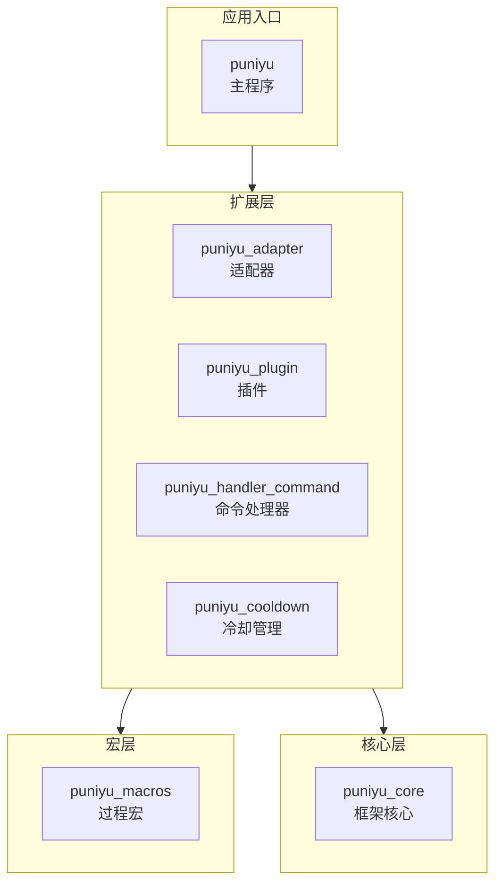

<div align="center">
  
</div>

<div align="center">

基于 Rust 的模块化即时通讯聊天机器人，围绕事件驱动架构与插件化设计构建

</div>

<br />

<div align="center">

[](LICENSE)
[](https://www.rust-lang.org)
[](https://github.com/puniyu/puniyu/releases/latest)
[](https://deepwiki.com/puniyu/puniyu)

</div>

<br />

---

<div align="center">

**[项目理念](#-项目理念) • [技术栈](#-技术栈) • [快速开始](#-快速开始) • [架构一览](#-架构一览) • [子 crate 简介](#-子-crate-简介) • [配置说明](#-配置说明) • [社区与链接](#-社区与链接) • [贡献指南](#-贡献指南) • [协议](#-协议)**

</div>

---

## 项目理念

puniyu 是一个基于 [puniyu_core](https://github.com/puniyu/core) 构建的即时通讯聊天机器人应用，旨在提供开箱即用的机器人运行时，同时保持高度可扩展性。项目围绕以下核心概念构建：

- **适配器（Adapter）**：连接不同聊天平台（如控制台、QQ 等）的桥梁，负责消息的收发
- **插件（Plugin）**：可插拔的功能模块，通过声明式宏快速开发，支持命令、定时任务、配置等扩展点
- **处理器（Handler）**：事件处理链路的核心，负责命令匹配、权限检查与执行分发
- **冷却控制（Cooldown）**：统一的命令与功能触发频率限制机制

项目采用 Cargo workspace 架构，将可复用能力拆分到独立 crate，方便按需依赖与独立迭代。

## 技术栈

- **异步运行时**：[Tokio](https://tokio.rs/) — 生产级异步运行时
- **核心框架**：[puniyu_core](https://github.com/puniyu/core) — 模块化机器人框架核心
- **序列化**：[Serde](https://serde.rs/) + TOML — 配置与数据序列化
- **Web 服务**：[Actix Web](https://actix.rs/) — HTTP 服务能力
- **命令解析**：[clap](https://docs.rs/clap) + puniyu_command_parser — 命令行与消息命令解析
- **宏能力**：[puniyu_macros](https://github.com/puniyu/puniyu/tree/main/crates/puniyu_macros) — 声明式插件、适配器、命令与任务宏
- **错误处理**：[thiserror](https://docs.rs/thiserror) — 友好的错误类型定义
- **日志**：[log](https://docs.rs/log) — 统一日志抽象
- **时间处理**：[jiff](https://docs.rs/jiff) — 现代时间与日期库

## 快速开始

### 环境要求

- Rust `1.88.0` 或更高版本
- Cargo

### 获取源码

```bash
git clone https://github.com/puniyu/puniyu.git
cd puniyu
```

### 运行

```bash
# 正常运行
just run

# 开发模式（使用本地配置）
just run-dev
```

或直接使用 Cargo：

```bash
cargo run --bin puniyu
```

### 构建发布版本

```bash
cargo build --release --bin puniyu
```

构建产物位于 `target/release/puniyu`。

### 运行测试

```bash
just test
```

## 架构一览



## 子 crate 简介

| Crate | 版本 | 说明 |
|-------|------|------|
| `puniyu_adapter` | 0.8.8 | 适配器开发入口库，提供编写平台接入层时最常用的模块、类型和宏入口 |
| `puniyu_plugin` | 0.8.8 | 插件开发入口库，提供更适合直接编写插件的门面层 API |
| `puniyu_handler_command` | 0.8.5 | 命令处理器，实现命令匹配、权限检查和执行分发流程 |
| `puniyu_cooldown` | 0.8.5 | 冷却管理库，用于控制命令或功能的触发频率 |
| `puniyu_macros` | 0.8.7 | 过程宏库，提供 `#[plugin]`、`#[adapter]`、`#[command]`、`#[task]` 等声明式入口 |

> [!TIP]
> 各子 crate 的详细使用文档请参考其目录下的 README。

## 配置说明

应用启动时会读取 `@puniyu/config/` 目录下的 TOML 配置文件：

### app.toml

```toml
masters = ["console"]   # 主人标识列表
prefix = "!"            # 命令前缀

[adapter]
disable_list = []       # 禁用的适配器列表
enable_list = []        # 启用的适配器列表

[logger]
enable_file = true      # 是否启用文件日志
level = "info"          # 日志级别
retention_days = 7      # 日志保留天数

[server]
host = "127.0.0.1"      # HTTP 服务监听地址
port = 33720            # HTTP 服务端口
```

### group.toml / friend.toml / bot.toml

```toml
[global]
alias = []   # 别名列表
cd = 0       # 全局冷却时间（秒）
mode = 0     # 模式
```

## 社区与链接

- **GitHub**：<https://github.com/puniyu/puniyu>
- **核心框架**：<https://github.com/puniyu/core>
- **DeepWiki**：<https://deepwiki.com/puniyu/puniyu>
- **QQ 群**：[1022851882](https://qun.qq.com/universal-share/share?ac=1&authKey=PKNBX8LArx1C8dmOpJG%2FVRPqivEZvCOwA9v9HNGC3TFxmtz1vjpT0OeoqsJzCZb3&busi_data=eyJncm91cENvZGUiOiIxMDIyODUxODgyIiwidG9rZW4iOiJxa3BNNTE0OFVsU25ETlFLVEx1NFBSWml2Ky9LaXhGd2VuYnphcmluaVZyRmJXa0lVdlIwSnFCeStxZXZvb3BWIiwidWluIjoiMzM2OTkwNjA3NyJ9&data=bPNY-UGLKcaZlWoL4qBAAM7OcMu4G3vifNNpLxB6luRVuFGcMjNqIcop4iU0Tn3igaekTbvQPUCuNPjo_F1P9g&svctype=4&tempid=h5_group_info)

## 贡献指南

欢迎贡献 puniyu 项目！我们非常感谢开源开发者的参与。

- 提交 PR 前请先查看现有代码风格
- 遵循 workspace 的 Rust 版本要求（`1.88.0`+）
- 确保 `cargo fmt` 和 `cargo clippy` 通过
- 新增功能请同步更新相关测试与文档
- 详细贡献规范请参考各子 crate 的 README

## 协议

puniyu 采用 [LGPL-3.0](LICENSE) 开源协议。
