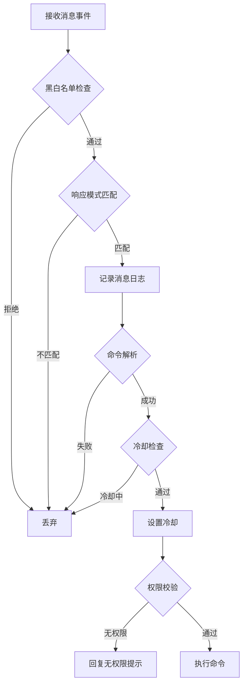

<div align="center">

# puniyu_handler_command

**命令处理器，实现命令匹配、权限检查、冷却控制与执行分发流程**

</div>

<div align="center">

[](https://crates.io/crates/puniyu_handler_command)
[](../../LICENSE)

</div>

---

## 概述

`puniyu_handler_command` 是 puniyu 的默认命令处理器。它接收消息事件后，依次执行黑白名单检查、响应模式匹配、命令解析、冷却控制、权限校验，最终将命令分发到对应的处理函数。

## 特性

- 基于 `puniyu_command_parser` 的命令文本解析
- 支持全局前缀 + 插件前缀组合
- 支持多种响应模式：全局、@机器人、别名、@或别名、仅主人
- 黑白名单权限控制（群组 / 好友维度）
- 多级冷却控制：全局、机器人、好友、群组、群成员
- 四级权限模型：All → Admin → Owner → Master
- 消息日志格式化输出

## 快速开始

### 添加依赖

```toml
[dependencies]
puniyu_handler_command = "0.8"
```

### 注册处理器

```rust
use puniyu_core::App;

App::builder()
    .with_handler(puniyu_handler_command::Handler)
    .build()
    .run()
    .await?;
```

### 定义并注册命令

命令通过插件侧的 `#[command]` 宏定义，处理器会自动从 `CommandRegistry` 中查找匹配的命令并执行：

```rust
// 在插件中定义命令
#[command(name = "ping", desc = "测试在线")]
async fn ping(ctx: &MessageContext) -> Result<CommandAction> {
    ctx.reply(Message::from("pong!")).await?;
    Ok(CommandAction::Stop)
}
```

## 处理流程



## 响应模式

通过配置文件 `bot.toml` 中的 `mode` 字段控制机器人的响应模式：

| 模式 | 值 | 说明 |
|---|---|---|
| All | 0 | 响应所有消息（默认） |
| AtBot | 1 | 仅响应 @机器人 的消息 |
| Alias | 2 | 仅响应包含别名前缀的消息 |
| AtOrAlias | 3 | 响应 @机器人 或别名前缀的消息 |
| Master | 4 | 仅响应主人的消息 |

## 权限模型

处理器根据消息发送者的身份判断权限等级：

| 权限 | 说明 |
|---|---|
| `All` | 所有用户 |
| `Admin` | 群管理员 |
| `Owner` | 群主 |
| `Master` | 机器人主人（在 `app.toml` 中配置） |

## 冷却控制

处理器在命令执行成功后自动设置冷却，冷却范围从大到小依次生效：

| 范围 | 配置来源 | 说明 |
|---|---|---|
| Global | `bot.toml` → `global.cd` | 全局冷却 |
| Bot | `bot.toml` → `bot.{id}.cd` | 单个机器人冷却 |
| Friend | `friend.toml` → `global.cd` / `friend.{id}.cd` | 好友冷却 |
| Group | `group.toml` → `global.cd` / `group.{id}.cd` | 群组冷却 |
| GroupMember | `group.toml` → `global.user_cd` / `group.{id}.user_cd` | 群成员冷却 |

## 消息日志

处理器会自动记录收到的消息，格式为：

```
[Bot:{bot_id}][GroupMessage:{group_id}-{user_id}]: text:你好
```

支持的消息元素类型：`text`、`at`、`reply`、`face`、`image`、`file`、`video`、`record`、`json`、`xml`

## 许可协议

与 puniyu 项目一致，采用 [LGPL-3.0](../../LICENSE) 协议。
